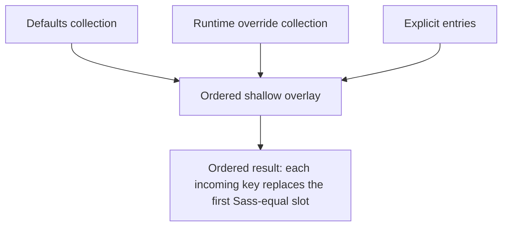
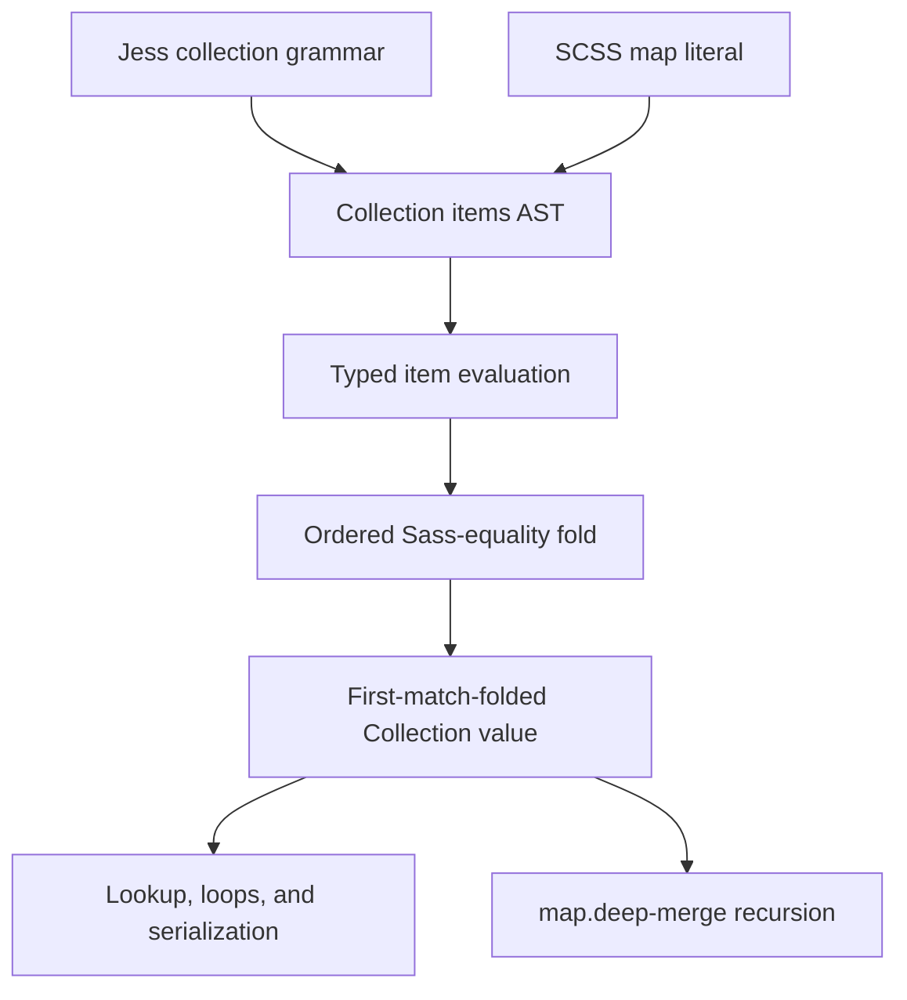

# Jess Collection Overlays - Plan

## Goal Capsule

- **Objective:** Jess authors and Sass-to-Jess conversion can compose collection defaults and overrides without verbose shallow merge calls or ambiguous key coercion.
- **Means:** Add JavaScript-shaped collection spread for shallow overlays, complete computed collection keys, and add Sass `map.deep-merge()` to the function package used by Jess's planned module boundary.
- **Product authority:** The owner selected spread, imported deep merge, computed keys, and runtime last-wins collision handling in the 2026-09-12 design dialogue; existing collection boundaries remain governed by `docs/architecture/core/DESIGN-DECISIONS.md` P14, P15, and P17.
- **Open blockers:** Core `ModuleImport` evaluation is still the explicit `jesscss/jess#182` stub in `packages/core/src/ast/serialize.ts`; this plan can ship the `@jesscss/fns/sass/map` export and document the intended `@-use '#sass/map'` spelling honestly, but making that directive executable is a separate module-loader project.

---

## Product Contract

### Summary

Jess collection literals may contain ordered spreads alongside explicit entries.
Spreads merge collections shallowly from left to right, while `map.deep-merge()` remains the explicit recursive operation in the Sass function package and the formal Jess module design.
Computed `[expression]: value` entries let native Jess author every key shape that Sass maps can represent.

### Problem Frame

Less makes overrides concise because variables, properties, matching mixins, and reopened namespaces all participate in a last-declaration-wins cascade.
That convenience depends on Less treating data lookup as part of its declaration and scope model.
Jess collections deliberately hold data rather than declarations, so implicit merge-on-reassignment would weaken the boundary recorded in P14.

Sass keeps maps as immutable values and provides exact shallow and recursive merge operations.
Real libraries use both: Element Plus deep-merges nested color configuration and shallow-merges many independent configuration maps, while Bootstrap treats merge and removal as separate operations.
Jess needs the common shallow operation to read like native collection construction without hiding recursive merge policy behind the same syntax.

### Key Decisions

- **Use collection spread for shallow composition.** (session-settled: user-approved — chosen over implicit collection reassignment and a binary merge operator: the JavaScript-shaped form matches a stated Jess influence and keeps composition inside the value.) Governs R1-R5.
- **Keep deep merge as an imported Sass map operation.** (session-settled: user-directed — chosen over native deep-spread syntax: Jess can expose the existing Sass operation without adding a second spread language.) Governs R6-R8.
- **Complete computed collection entries in the same work.** (session-settled: user-directed — chosen over identifier-only authoring: Sass key expressions may produce any Sass value, so conversion needs a native value-key form.) Governs R9-R11.
- **Resolve native collisions at runtime with the later value.** (session-settled: user-directed — chosen over duplicate-key rejection: spread implies possible duplication, and explicit entries must follow the same rule.) Governs R2-R4, R12-R14.
- **Warn only for duplicate keys visible in one literal.** (session-settled: user-approved — chosen over either silence or rejection: a warning can catch an accidental repeated definition without making dynamic spread invalid.) Governs R13-R14.

### Requirements

**Shallow collection overlays**

- R1. A Jess collection literal accepts a spread item spelled `...expression;` anywhere it accepts an explicit collection entry.
- R2. Jess evaluates explicit entries and spreads from left to right, and a later Sass-equal key replaces the earlier value.
- R3. A key keeps the position where it first entered the result, while a key that has not appeared before is appended.
- R4. Each incoming entry replaces the first existing Sass-equal key found by the shared map-key comparator, so ordinary duplicate keys have one later-wins effective entry; this work does not redesign that comparator's existing coercive or non-transitive edge cases.
- R5. A spread operand must evaluate to a Collection; any other value produces a typed evaluation error.



**Recursive composition**

- R6. `@jesscss/fns/sass/map` exports Sass `map.deep-merge()` because `packages/fns/src/sass/map/index.ts` does not currently implement it.
- R7. `map.deep-merge()` recursively merges a colliding pair only when both values are Collections; otherwise the later value replaces the earlier value.
- R8. Jess design documentation uses `@-use '#sass/map' as map;` plus `$map.deep-merge()` as the formal recursive shape, clearly labels the existing module-execution gap, and does not introduce deep-spread syntax in this work.

**Computed keys and dialect behavior**

- R9. A Jess collection accepts `[expression]: value` so the evaluated expression supplies the key without converting it to an identifier string.
- R10. Bare and computed Keyword keys share one key domain, so `red:` and `[red]:` are equal because bare `red` remains a Keyword; `[#c6538c]:` demonstrates a distinct Color key.
- R11. Numeric subscripts remain positional under P15, so `map.get()` remains the accessor for numeric Collection keys even though `[1px]: value` can author one.
- R12. Native Jess permits duplicate explicit keys and resolves them with R2.
- R13. Diagnostics warn when two explicit entries in the same native Jess collection have statically comparable equal keys, while compilation continues and the later value wins.
- R14. Diagnostics do not warn about collisions introduced by spreads or keys whose equality depends on expression evaluation.
- R15. This feature does not broaden or tighten the SCSS parser's existing duplicate-map-key behavior; native Jess's warning policy applies only to `.jess` collection literals.

**Sass-to-Jess conversion**

- R16. Sass `map-merge($left, $right)` remains a function call handled by the global Sass registry; parser lowering does not replace function binding, diagnostics, or dispatch.
- R17. A Sass map key that is not the ordinary Jess identifier-key form lowers to a computed Jess entry rather than to serialized or re-parsed key text.
- R18. Sass `$map.deep-merge($left, $right)` remains an explicit call through `@-use '#sass/map' as map;` rather than lowering to shallow spread.
- R19. Namespaced and variadic map operations remain function calls; module loading is a separate runtime concern.

### Key Flows

- F1. Shallow library override
  - **Trigger:** A library combines authored defaults with a consumer-supplied Collection whose keys are only known at evaluation time.
  - **Steps:** The collection evaluates the defaults spread, then the consumer spread, then any trailing explicit entries; each collision replaces the earlier value in its existing position.
  - **Outcome:** Consumers can add or override individual keys without copying the default collection.
  - **Covers:** R1-R5.
- F2. Nested library override
  - **Trigger:** A consumer supplies a partial nested configuration such as Element Plus's color tokens.
  - **Steps:** The stylesheet uses the formal `#sass/map` spelling and calls `$map.deep-merge($defaults, $overrides)`; the function implementation recursively merges colliding Collection children and replaces other values.
  - **Outcome:** Unmentioned nested defaults survive without assigning recursive behavior to ordinary spread.
  - **Covers:** R6-R8.
- F3. Sass map conversion
  - **Trigger:** The SCSS parser encounters a map literal key that the ordinary Jess identifier form cannot represent.
  - **Steps:** The key expression becomes a computed entry; map functions remain function calls.
  - **Outcome:** The shared AST represents native Jess data without moving Sass function semantics into parsing.
  - **Covers:** R9-R19.

### Acceptance Examples

- AE1. **Covers R1-R4.** Given `$defaults` is `{ a: 1; b: 2; }` and `$overrides` is `{ b: 3; c: 4; }`, `{ ...$defaults; ...$overrides; }` evaluates in the order `a`, `b`, `c` with values `1`, `3`, `4`.
- AE2. **Covers R2, R4, R12-R13.** `{ a: 1; a: 2; }` is valid native Jess, emits a duplicate-key warning, and resolves `a` to `2`.
- AE3. **Covers R2, R12, R14.** A spread whose runtime Collection contains `a` may collide with an earlier `a` without a static diagnostic, and the spread's value wins.
- AE4. **Covers R9-R10, R12-R13.** `{ red: 1; [red]: 2; [#c6538c]: 3; }` warns that the two Keyword keys are equal, resolves `red` to `2`, and retains the distinct Color key `#c6538c` with value `3`.
- AE5. **Covers R6-R8.** If the defaults contain `{ colors: { primary: blue; secondary: grey; } }` and the override contains `{ colors: { primary: teal; } }`, shallow spread replaces the `colors` Collection while the exported `map.deep-merge()` implementation retains `secondary` and changes `primary` to `teal`.
- AE6. **Covers R5.** `{ ...12px; }` reports a Collection operand type error.
- AE7. **Covers R15.** Adding the Jess duplicate-key warning does not emit that warning for SCSS `(a: 1, a: 2)`.

### Scope Boundaries

- This work does not make variable redeclaration merge Collections implicitly.
- This work does not add deep-spread, path-assignment, or collection-aware assignment operators.
- This work does not encode deletion as `null`, an empty value, or a spread tombstone; `map.remove()` and `map.deep-remove()` remain separate operations.
- This work does not change P15's positional interpretation of numeric subscripts.
- This work does not give `.jess` an ambient builtin namespace; Sass map operations remain explicit module imports under P17.
- This work does not implement the still-open core `ModuleImport` loader/binder; documentation must not present `@-use` execution as currently shipped until that separate architecture lands.

### Sources / Research

- `docs/RECORD-MAP.md` identifies `docs/architecture/SEMANTIC-INVARIANTS.md` and `docs/architecture/core/DESIGN-DECISIONS.md` as the semantics authorities.
- `docs/design/COLLECTION-VALUE-KEYS.md` records the value-keyed Collection design, computed-key intent, and Collection-versus-AnonymousMixin boundary; U5 corrects its former `[red]`-as-Color example under R10.
- `packages/core/src/ast/value-factory.ts` records authored entry order and caller-owned de-duplication, while `packages/fns/src/sass/map/merge.ts` already implements Sass's shallow replacement and ordering behavior.
- `packages/syntax/jess/jess-parser/src/grammar.ts` currently accepts only identifier Collection entries.
- [Less maps and accessors](https://lesscss.org/features/) document last-declaration-wins variables, property accessors, matching-mixin aggregation, and rulesets or mixins used as maps.
- [Sass maps](https://sass-lang.com/documentation/values/maps/) define map keys as expressions whose results may be any Sass value, require unique Sass map keys, and use Sass equality for key identity.
- [Sass map functions](https://sass-lang.com/documentation/modules/map/) define shallow merge ordering, recursive deep merge, path operations, setting, and removal.
- [Element Plus common variables](https://github.com/element-plus/element-plus/blob/01fbc67670aeb0391706b4106809140a35d188e9/packages/theme-chalk/src/common/var.scss#L15-L73) use deep merge for nested color configuration and generated color levels, alongside shallow merges for other configuration maps.
- [Bootstrap Sass customization](https://getbootstrap.com/docs/5.3/customize/sass/) treats replacement, extension, and removal as separate map operations and warns that removing required keys can break consumers.

---

## Planning Contract

### Key Technical Decisions

- KTD1. **Represent spread as a dedicated AST item.** (session-settled: user-approved — chosen over an optional flag on `CollectionEntry`: a separate discriminant keeps entry and spread shapes monomorphic and makes traversal exhaustive.) `Collection.entries` becomes an ordered union of explicit entries and spreads; the evaluated value-domain Collection holds effective ordered entries after first-match folding. Governs R1-R5.
- KTD2. **Fold overlays once after typed evaluation.** Evaluate each authored item exactly once, then fold the resolved items in source order with the existing Sass-equality key primitive. Replacement updates the first matching slot and new keys append; the existing comparator's coercive key-identity design is not broadened here. Governs R2-R5, R12.
- KTD3. **Keep computed keys inside the grammar.** A bracket-delimited key parses through the existing Jess value grammar and reduces directly to the entry's `key`; no source slicing, regex recognition, or reparsing is introduced. Governs R9-R11.
- KTD4. **Make duplicate detection a CST diagnostic.** The warning is cold-path editor analysis over direct `CollectionEntry` children. It compares only scalar keys whose equality is provable from authored syntax and skips spreads or runtime-dependent expressions. Governs R13-R15.
- KTD5. **Keep Sass map operations in the function boundary.** `map.merge` and `map-merge` remain FunctionCalls. Native Jess spread and Sass function calls share the value-domain overlay helper, not an AST rewrite. Governs R16-R19.
- KTD6. **Implement recursive merge in the Sass function module.** `deepMerge` is a JavaScript export whose function object remains named `deep-merge`, matching the existing camelCase-export/dash-case-call convention. Recursion creates new Collections and never mutates inputs. The formal Jess import spelling remains documentation of the intended module boundary until the separately tracked loader exists. Governs R6-R8.

### High-Level Technical Design

The source AST distinguishes authored operations, while evaluation produces the same Collection value consumed by lookup, loops, serialization, and Sass functions.



The grammar surface is intentionally small:

```text
collection-item := identifier ":" value ";"?
                 | "[" value "]" ":" value ";"?
                 | "..." value ";"
```

This sketch is directional grammar guidance; the actual Parseman productions must preserve the repository's existing value boundaries and macro-compilable structure.

### Assumptions and Constraints

- The existing `SASS_EQUAL` comparison remains the single authority for runtime key identity.
- Static diagnostics need not prove equality for variables, calls, operations, interpolations, composite keys, or spread contents.
- Existing SCSS duplicate-map-key behavior is not part of this feature; the new Jess warning must remain dialect-scoped.
- Parser and evaluator changes are hot-path work and must satisfy the grammar, performance, and semantic review contracts before landing.

---

## Implementation Units

### U1. Add ordered collection items and overlay evaluation

- **Goal:** Give the canonical source AST an explicit spread item and make Collection evaluation produce the required shallow last-wins result.
- **Requirements:** R1-R5, R12; KTD1-KTD2.
- **Dependencies:** None.
- **Files:** `packages/core/src/ast/nodes.ts`, `packages/core/src/ast/node.ts`, `packages/core/src/ast/traversal.ts`, `packages/core/src/ast/serialize.ts`, `packages/core/src/ast/value-factory.ts`, `packages/core/src/ast/__tests__/node-contract.test.ts`, `packages/core/src/ast/__tests__/traversal.test.ts`, `packages/core/src/ast/__tests__/collection-value-direct-acceptance.test.ts`.
- **Approach:** Add one dedicated spread node and an ordered collection-item union. Keep `Collection` data-only and lower SCSS nested-property syntax to its distinct structural node. Evaluate spread operands as typed values, reject non-Collections, and fold explicit/spread entries with shared key equality while preserving first insertion position.
- **Execution note:** Add direct failing evaluator and traversal tests before changing production code; retain the synchronous fast path explicitly.
- **Patterns to follow:** Existing plain-object factories in `nodes.ts`, exhaustive traversal switches, `combineAll`/`MaybePromise` evaluation, and `collectionEntryIndex` key identity.
- **Test scenarios:**
  - Covers AE1. Two collections with overlapping and new keys produce `a, b, c` in first-insertion order and use the later `b` value.
  - Covers AE2. Two explicit `a` entries produce one evaluated entry with the second value.
  - Covers AE3. A runtime spread collision replaces an explicit value without evaluating either operand twice.
  - Covers AE6. Spreading `12px` raises a type mismatch.
  - An empty spread and an empty literal produce a normal empty Collection.
  - Traversal visits spread operands under a distinct stable path while nested-property consumers continue to process only explicit entries.
- **Verification:** Core AST tests prove node membership, traversal, synchronous evaluation, ordering, collision replacement, and operand errors.

### U2. Parse native computed keys and spreads

- **Goal:** Make the settled Jess syntax authorable through both AST and positioned CST parser modes.
- **Requirements:** R1, R9-R12; KTD1, KTD3.
- **Dependencies:** U1.
- **Files:** `packages/syntax/jess/jess-parser/src/grammar.ts`, `packages/syntax/jess/jess-parser/src/grammar-helpers.ts`, `packages/syntax/jess/jess-parser/test/ast-grammar.test.ts`, `packages/syntax/jess/jess-parser/test/public-parse.test.ts`.
- **Approach:** Add bracket-key and spread productions around the existing Collection entry/value grammar, route their reductions to the new AST item, and keep bare identifiers on the Keyword path. Preserve host-mode AST/CST parity and avoid post-parse interpretation.
- **Execution note:** Capture AST/CST characterization and parser benchmark baselines before the grammar edit, then start from failing public parser examples.
- **Patterns to follow:** Existing host-mode node reductions, `jessValueSlot`, grammar helper predicates, and P13's positional `$` matrix.
- **Test scenarios:**
  - Covers AE4. `red:` and `[red]:` both create Keyword keys, while `[#c6538c]:` creates a Color key.
  - `[$key]: value` preserves the variable lookup as the key expression.
  - `[1px]: value` authors a Dimension key without changing positional bracket lookup behavior.
  - A spread may appear before, between, and after explicit entries and requires its terminating semicolon.
  - AST and CST modes consume the full source and agree on the authored item sequence.
- **Verification:** Jess parser tests, macro/compose-integrity checks, runtime-boundary checks, and a named before/after Jess parse benchmark establish correctness and parser cost.

### U3. Warn for provable duplicate native keys

- **Goal:** Surface likely accidental duplicate explicit keys without changing compilation or dynamic overlay semantics.
- **Requirements:** R10, R12-R15; KTD4.
- **Dependencies:** U2.
- **Files:** `packages/diagnostics-core/src/tolerant-cst.ts`, `packages/diagnostics-core/src/rule-aliases.ts`, `packages/diagnostics-core/test/tolerant-cst.test.ts`.
- **Approach:** Register a Jess-only warning and compare direct explicit entries within each Collection. Canonicalize only authored scalar forms whose Sass equality is locally provable; skip spread nodes and expression-dependent keys.
- **Patterns to follow:** Existing `LINT_CODES`, rule aliases, CST child helpers, emitted-diagnostic de-duplication, and language-scoped lint checks.
- **Test scenarios:**
  - Covers AE2. `{ a: 1; a: 2; }` reports one warning at the later key and no parse error.
  - Covers AE4. `red:` followed by `[red]:` warns, while `[#c6538c]:` remains distinct.
  - Covers AE3. A possible collision through `...$overrides;` does not warn.
  - Two computed variable, function, interpolation, or operation keys do not warn merely because their source text matches.
  - Equivalent static quoted/Keyword keys warn when the existing Sass equality defines them as equal.
  - SCSS map literals do not receive the Jess warning.
- **Verification:** Diagnostics tests prove code, severity, span, dialect scoping, and false-positive boundaries.

### U4. Expose deep merge and preserve Sass function calls

- **Goal:** Provide the recursive Sass function implementation chosen for Jess's formal design while keeping Sass merge calls in the function registry.
- **Requirements:** R6-R8, R16-R19; KTD5-KTD6.
- **Dependencies:** U1.
- **Files:** `packages/fns/src/sass/map/deep-merge.ts`, `packages/fns/src/sass/map/index.ts`, `packages/fns/src/__tests__/sass-map-functions.test.ts`, `packages/fns/src/sass/__tests__/map-functions.test.ts`, `packages/syntax/scss/scss-parser/src/grammar-helpers.ts`, `packages/syntax/scss/scss-parser/src/grammar.ts`, `packages/syntax/scss/scss-parser/test/ast-grammar.test.ts`, `packages/jess/test` integration coverage selected during implementation.
- **Approach:** Implement immutable recursive merge by replacing colliding scalar values and recursively merging colliding Collections. Export it through the Sass map package entrypoint. Keep shallow merge spellings as function calls so argument binding, diagnostics, and dispatch stay function-owned.
- **Execution note:** Test the Sass function directly and characterize SCSS call ASTs before changing their reducer. Do not fake an end-to-end `@-use` pass while core `ModuleImport` remains a serializer stub.
- **Patterns to follow:** `map/merge.ts`, `map/util.ts`, Sass module export naming in `EXPORT_STRUCTURE.md`, and the existing `map.get` parser lowering.
- **Test scenarios:**
  - Covers AE5. Deep merge preserves an unmentioned nested sibling and replaces the selected nested value.
  - Deep merge replaces a Collection with a scalar, and a scalar with a Collection, when only one side is a Collection.
  - Deep merge preserves first-map key order and appends keys introduced by the second map at each recursion level.
  - Inputs and nested Collections remain unchanged after the call.
  - The public Sass map package entrypoint exports a function named `deep-merge`; module docs keep the future `@-use` spelling visibly separated from current executable behavior.
  - Two-positional, named, and variadic `map.merge` / `map-merge` spellings remain FunctionCalls.
- **Verification:** Function-library and SCSS parser tests prove the export, recursive behavior, function-call boundary, and rendered result; documentation validation proves the module-runtime caveat remains visible.

### U5. Make documentation and design records match the shipped language

- **Goal:** Remove every stale named-color/computed-key statement and document spread, duplicate resolution, warning behavior, and imported deep merge as one coherent feature.
- **Requirements:** R1-R19.
- **Dependencies:** U1-U4.
- **Files:** `docs/design/COLLECTION-VALUE-KEYS.md`, `docs/architecture/core/DESIGN-DECISIONS.md`, `packages/core/src/ast/value-eval.ts`, `packages/docs/docs-content/docs/jess/02-Language/10-namespaces-and-maps.mdx`, `packages/docs/docs-content/docs/shared/02-Language/14-modules-and-imports.mdx`, `packages/fns/src/sass/EXPORT_STRUCTURE.md`, plus every repository occurrence found by a complete text search that encodes the obsolete `[red]`-is-Color or computed-keys-unimplemented claims.
- **Approach:** Mark P14's implemented surface accurately, replace the misleading named-color example with a real hex Color key, add native overlay examples, use `$map.deep-merge` as the recursive example, explain later-wins plus the static warning, and update Sass module/function inventories.
- **Patterns to follow:** The collection method-of-record and existing Jess language-reference examples.
- **Test scenarios:** Test expectation: none -- this unit aligns documentation and code comments with behavior already covered by U1-U4.
- **Verification:** Repository-wide searches find no stale implementation-status or named-color-as-Color claim; docs validation and record-map checks pass.

---

## Verification Contract

| Gate | Applies to | Done signal |
| --- | --- | --- |
| Focused core, parser, diagnostics, function, and Jess integration suites | U1-U4 | Every named scenario passes against freshly built dependencies. |
| `pnpm run build:release` | U1-U5 | All affected packages compile in dependency order with no stale artifact ambiguity. |
| `pnpm run check:macro` and `pnpm run verify:compose-integrity` | U2, U4 | Both report zero interpreter fallbacks for the changed grammars. |
| `pnpm run verify:parser-runtime-boundary:clean` | U2, U4 | No handwritten parser recognition or reparse path is introduced. |
| `pnpm run verify:hot-path:clean` and `pnpm run verify:shape-stability` | U1, U2, U4 | No new hot-path anti-pattern or polymorphic AST shape is introduced. |
| Named Jess parser before/after benchmark from `docs/perf/BENCHMARKS.md` | U2 | Resolved parser/Parseman paths and versions are recorded; material regressions are investigated, sub-noise movement is reported as inconclusive. |
| `pnpm run verify:types`, `pnpm run lint:production`, and `pnpm run lint:tests` | U1-U5 | Type and lint gates are green without new absolute-lint violations. |
| `pnpm run check:guardrails`, `pnpm run check:record-map`, and docs-content validation | U5 | Owner records remain protected and documentation links/content validate. |
| Jess release ratchet and Less byte-identity gates required by the repo sync policy | Whole change | Canonical runtime and compatibility baselines remain green by name. |

### Required Review Evidence

- Grammar reviewer: evidence for every changed or added grammar `const`, including host-mode shape, composition, ambiguity, and parse-performance result.
- Performance architecture reviewer: evidence against each applicable invariant in `docs/perf/V8-ARCHITECTURE.md`, with counts or structural proof where timing cannot resolve the effect.
- Semantics reviewer: evidence against each invariant in `docs/architecture/SEMANTIC-INVARIANTS.md`, including why key identity, ordering, and emitted bytes match the settled design rather than an accidental compatibility oracle.
- API-surface review: required if the new AST node or Sass module member changes a public package export.

---

## Definition of Done

- Native Jess parses and evaluates explicit entries, computed keys, and ordered spreads; each incoming key replaces the first Sass-equal slot while preserving entry order.
- Invalid spread operands fail with a typed evaluation error; dynamic spread collisions remain valid and do not generate speculative diagnostics.
- Diagnostics warn only for provable duplicate explicit keys in a `.jess` Collection and compilation still succeeds.
- The Sass map package entrypoint exports working immutable `deep-merge`, and design documentation uses the future `#sass/map` module spelling without claiming the current stub executes it.
- Sass map merge calls remain `FunctionCall` nodes; native ordered spread is authored Jess syntax and does not take over Sass path or named-argument semantics.
- P14, the collection design record, user docs, function inventory, code comments, and examples no longer claim that bare `red` is a Color or that computed keys are unimplemented.
- All Verification Contract gates and required adversarial reviews are green and named.
- The branch is synchronized safely with `origin/dev`, the final push is fast-forward, and `HEAD..origin/dev` is empty under the repository's landing policy.
